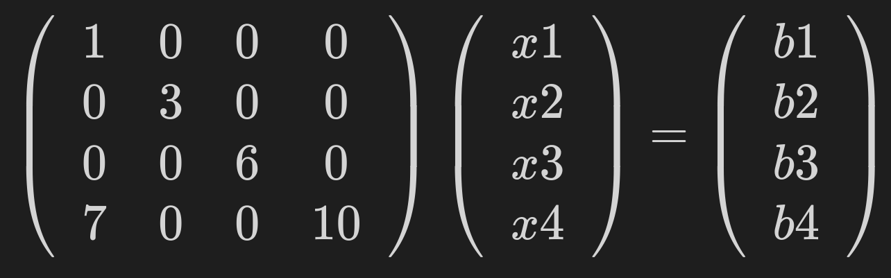

# SMT Matrix Solver

This coding project, a part of a university application, was designed to be completed in one week. 

It involved the coding of solver of the lower triangle of a matrix.
The solver was to be optimised for sparse matrices, and had to involve parallelism. 

Here is an example of such a matrix. The solver is solving the _x_ vector.


<!-- $$
\left(\begin{array}{cc} 
1 & 0 & 0 & 0 \\
0 & 3 & 0 & 0 \\
0 & 0 & 6 & 0 \\
7 & 0 & 0 & 10
\end{array}\right)
\left(\begin{array}{cc} 
x1 \\
x2 \\
x3 \\
x4
\end{array}\right)
=
\left(\begin{array}{cc} 
b1 \\
b2 \\
b3 \\
b4
\end{array}\right)
$$ -->

Therefore, the solver comes in two kinds, a naive solver, that solves it with a direct single threaded approach, and a optimised approach, in which layering and parallelism is used.

## Inputs 
The inputs that that the solver had to work for were __[TSOPF_RS_b678_c2](https://sparse.tamu.edu/TSOPF/TSOPF_RS_b678_c2)__ and __[torso1](https://sparse.tamu.edu/Norris/torso1)__ matrices in __[matrix market format](https://people.sc.fsu.edu/~jburkardt/data/mm/mm.html)__.

For development and testing other small matrices were made and used. They can be found under __[test_inputs](./Inputs/test_inputs)__.

### Reading of The Inputs
The inputs must be read by the c reader when they are only in a lower triangle matrix. All rows and cols should also be in ascending order. The .mtx file should be kept in coordinate form as well. 

The python file __[create_leftside_mtx.py](./home/aliraeis/Projekte/SMT_Matrix_Solver/Inputs/mtx_files/create_leftside_mtx.py)__ can create a left side matrix and sort the rows. The first argument needs to be the input file and the second argument must be the output file. 

For example 
```
python create_leftside_mtx.py TSOPF_RS_b678_c2.mtx TSOPF_RS_b678_c2_leftside.mtx
```
#### How the Code Reads the Matrix
The reader uses a modified version of the library and code provided by __[ANSI C library for Matrix Market I/O](https://math.nist.gov/MatrixMarket/mmio-c.html)__.

It also stores the information of the matrix in a handy struct. Also it computes the layering information that explained below.


## Running the Solver
After the input is in the desired format, the solver can be compiled using the make file. Simply run
```
make
```

The sample outputs can also be run by issuing any of these commands:

```
make run_naive_1
make run_naive_2
make run_opt_1
make run_opt_2

```
1 refers to the torso matrix, and 2 refers to the TSOPF.

The solver can also be run manually. **Note all input files must adhere to the standard mentioned above**.
```
# the format of arguments to follow is
# ./solver.o {action} {input_matrix} {b_vector}
# action may be any of the following: test, naive, opt (for the optimised solver)
# for example 
./solver.o naive t1.mtx t1_b.mtx
```

## Verification
The verification of the solver is simple. It multiplies each row with the computed solution matrix, _x_ vector, and tries to match with the original _b_ vector. This equality is only acceptable within a threshold. Some accuracy may be lost during the computation. 

Two functions do verification: one stores the inaccuracies, and the other rejects the inaccuracy as invalid. 

## Optimisation

__[Open Mp](https://www.openmp.org/)__ was used for the parallelisation. It was very tricky trying to come up with how this should be done. 

These matrices have dependencies of rows. To solve row _n_, some rows _n' < n_ might have to be solved first. 

The technique used here was to layer the rows. 

In the first section, rows would be computed in succession.

Then all rows that could be computed given the first section of rows are broken in to multiple threads. These threads would run in parallel to each other. Basically, all the dependencies that would exist within the thread would be only inside that thread. These threads are basically the reach of the rows in the first section.

A second layer would also be computed based on all the rows computed in the first section, and the first layer. This too would be split into threads with no inter-dependencies. 

Then all rows that could not fit any of the above layers would be computed in succession. 

This layering technique required some analysis in part of the reader of the mtx files. To achieve this a dynamic list data structure was coded. The reading of the layers added some overhead costs to the computation.

The motivation here was to increase the number of rows that are being computed in parallel. 

There were many tradeoffs with the parameters of this algorithm. Firstly, the number of rows in the first section need not be too long, or else less will be computed in parallel, and not to short, or else the threads will have a lot of their dependencies unmet. 

The number of threads in each of the layers could increase the parallelisation of the algorithm, but could also shorten the length of each reach threads. As the dependencies would be split up amongst more threads, making more rows unreachable by the threads.

## Outputs

The solution is written to a __sol.csv__ file.

The inaccuracies are written to __inaccuracies.csv__.

The already computed solution and inaccuracies of the solvers can be found in __[here](./Sample_Outputs)__.

Each solve is also accompanies by some statistics of the job, such as
```
> make run_naive_1
./solver.o naive Inputs/mtx_files/torso1_leftside.mtx  Inputs/mtx_files/b_for_torso1.mtx
Computation Time Naive: 593 ms
Solution produced in sol.csv
Inaccuracies recorded in inaccuracies.csv
```

The optimised solvers also output the information about the layers.
```
> make run_opt_1
./solver.o opt Inputs/mtx_files/torso1_leftside.mtx  Inputs/mtx_files/b_for_torso1.mtx
Num first section: 10000 ---------------------------
Layer 1---------------
Reach[0]
Size: 5000
Num Elem: 133
Reach[1]
Size: 5000
Num Elem: 129
Layer 2---------------
Reach[0]
Size: 5000
Num Elem: 162
Reach[1]
Size: 5000
Num Elem: 167
Not Reach-------------
Size: 160000
Num Elem: 105567
Computation Time: 1340 ms
Solution produced in sol.csv
Inaccuracies recorded in inaccuracies.csv
```

All computation times are only the time for the solver. The read and other preliminary actions are not timed.

The _Num Elem_ are the number of rows stored in each thread, and the _Size_ is the actual size of the array that holds the dynamic list.

## Results

The results of the solvers yielded very relatively high accuracies. 

The torso1 input had better accuracy than the TSOPF. 

The naive and optimised approaches yielded the same results with the same inputs.

### Results of the Optimisation

The optimisation work did not give better time readings as compared to the naive solver. This might be due to faults in the code, the low number of rows computed in parallel, and the overhead costs of parallel code.

The TSOPF saw better results for the optimised version. More of the rows were stored in parallel layers, and the computation time was comparable to that of the naive one.

Compare 
```
> make run_naive_2
./solver.o naive Inputs/mtx_files/TSOPF_RS_b678_c2_leftside.mtx Inputs/mtx_files/b_for_torso1.mtx
Computation Time: 119 ms
Solution produced in sol.csv
Inaccuracies recorded in inaccuracies.csv
```

to this
```
> make run_opt_2
./solver.o opt Inputs/mtx_files/TSOPF_RS_b678_c2_leftside.mtx Inputs/mtx_files/b_for_torso1.mtx
Num first section: 10000 ---------------------------
Layer 1---------------
Reach[0]
Size: 5000
Num Elem: 4343
Reach[1]
Size: 5000
Num Elem: 4341
Layer 2---------------
Reach[0]
Size: 5000
Num Elem: 218
Reach[1]
Size: 5000
Num Elem: 219
Not Reach-------------
Size: 20000
Num Elem: 16575
Computation Time: 301 ms
Solution produced in sol.csv
Inaccuracies recorded in inaccuracies.csv
```

You can see that there are much more rows in the first layer than the torso1 optimised results. 

## Further Steps

The layering is done sort of haphazardly. There could be a more dynamic way to create and store the layers. Also there must be a better way for the threads of reaches to be identified so as to increase the number of rows that can be computed in parallel. Specifically, the way rows are split into the different threads can have a huge impact on the number of rows reached by that thread. The scheduling of the threads follows, a _0, 0, 0, 1, 1, 1, 2, 2, 2, 0, 0, 0, 1, 1, 1, 2 ..._ pattern, where each index of thread is repeated for the number of threads. This pattern might not yield the best reachability results. This might be the ending kick to make the optimised solver run faster than the naive implementation.

The reading and storing the layers does take a very long time. In fact it could be in the minutes when run for the first time. There is simply a lot of checks that happen in a sort of naive way. A better approach would be to use a tree, but this would add significant complexity to the code.

The requirement for the input mtx files is really stringent. The reader should accept a more liberal format, and fix the user's discrepancies on its own.

There are sections of the code that can be refactored for a better design. Many inputs do not verify, and trust the client's honesty. 

<br> <br> <br>

## The Moment
In loving memory of my grandfather who died during the week that I was working on this project. I have named this project after him (**S**eyed **M**ojtaba **T**abatabaei Matrix Solver). Please pray for him. 

